## Web标准：

> 网页中web标准三层组成：主要是结构、表型、行为三方面

- 结构：主要是`HTML`
- 表现：主要是`CSS`
- 行为：主要是`JavaScript`

------


## 1、图片标签【4.2】

```
1、src图片地址
2、alt图片加载失败显示文字
3、title鼠标经过图片显示的文字
4、width height 图片的宽高（像素、百分比）
5、border 边框

相对路径：图片位于HTML文件的位置
        同一级目录，直接引入图片名即可
        下一级目录，images/1.jpg
        上一级目录，../images/1.jpg
        上两级目录，../../images/1.jpg
绝对路径：
1、E:\1111111111桌面文件\文档和图片\1.jpg
2、绝对的网络地址https://jiaowu.maitao.com/img/logo.65e41621.png
```

------


## 2、超链接【4.2】

> 1. 一对标签，含有开始个结束标签
> 2. href 指向需要跳转的链接地址
> 3. 网站链接地址，必须前面加 `http://`
> 4. 本地链接必须加后缀
> 5. 标签可以嵌套——图片。。。

```
1、href 链接URL
	绝对路径：
       互联网地址：格式： http://域名
       本地绝对地址：格式：file：///盘符/...
	相对路径：相对于自己的位置
    	./ 代表当前目录  ../ 代表上一级
2、target  _bank 在新窗口打开  _self在本窗口打开（默认）
3、在新窗口中打开,可控制所有页面：在head中<base target="_blank"></base>
```
------


## 3、锚点【4.2】

设置`<a  href="#xxx"> </a> `

两种方式:
- id=xxx
- `<a name="#xxx"></a>`

------


## 4、块元素.行内元素.行内块元素【4.2】

### **4.1.块级元素：**

> 块级元素：`H1~h6、p、ul、ol、li、div`
>

**块级元素特点**：

- 独占一行<br>
- 高度、宽度、外边距、内边距都可以控制设置
- 宽度默认是容器的100%
- 是一个容器或者盒子，里面可以放行内或者块级元素

**注意：**

- 只有文字才能组成段落，p标签里面不能放块级元素，特别是div
- `H1~h6、dt`都是文字类型块级标签，里面都不可以放其他块级元素  

### **4.2.行内元素：**

> 行内元素：`a、strong、b、em、i、del、s、ins、u、span（典型）<br>`

**行内元素特点：**

- 相邻元素在一行上，一行可以显示多个
- 高宽设置无效
- 默认宽度是本身的宽度
- 行内元素只能容纳文本或者其他行内元素

**注意：**

- 链接里面不能再放链接
- **特殊情况a里面可以放块级元素，但是给a转换一下块级元素最安全**

### **4.3.行内块元素：**

> 行内块元素：`img、input、td`

**行内块元素特点：**

- 和相邻行内块元素子在一行上，中间留有空白缝隙，一行可显示多个
- 默认宽度是本身的宽度
- 高度、行高、外边距、内边距都可以设置

------


## 4-2、标签显示模块转换【4.2】

> 转换为块元素：`display:block;`
>
> 转换为行内元素：`display:inline;`
>
> 转换为行内块元素：`display:inline-block;`

------


## 5、无序和有序列表【4.18】

- 无序列表为`<ul>`
- 有序列表为`<ol>`,  type，数字数字1，小写字母a，大写字母A,小写罗马i，大写I
- 自定义列表为`<dl>`
- 列表项目标记`<li>`
- `ul、li`属性 type。disc实心圆、circle空心 圆、square小方块、none不显示
`ul`标签的组合是`li`

------


## 6、自定义列表【4.21】

**自定义列表:**

- `dl`下，第一层列表项`dt`，第二层注释项`dd`

**实例：**
```html
<dl>
    <dt>上海行健</dt>
    <dd>职业学院</dd>
    <dd>软件</dd>
</dl>             
```

------

## 7、表格的基础结构【4.27】

**1、表格的基础结构：**

- `<table>`定义表格、`<tr>`定义行、`<td>`定义单元格
- `<caption>`定义表格标题、`<th>`定义表格页眉的单元格
- `<thead>`定义表格头、`<tbody>`定义表格的主体
- `<tfoot>`定义表格脚

**2、table属性：**

- `width`表格宽度、`height`表格高度
- `align`表格摆放位置、`background`表格背景图片
- `bgcolor`表格背景颜色、`border`表格边框宽度
- `bordercolor`表格边框颜色、`cellspacing`单元格间距
- `cellpadding`单元格之间空白距离

**3、表格行的常用属性：**

- height行高、align行内容的水平对齐、valign(top、middle、bottom)行垂直对齐
- bgcolor行的背景颜色、colspan单元格跨列、rowspan单元格跨行
------

## 8、iframe框架【4.29】

> width框架的宽、height框架的高、name框架名称、src页面路由、scrolling（yes、no、auto）是否显示滚动条、frameborder（1有、0无）边框
>

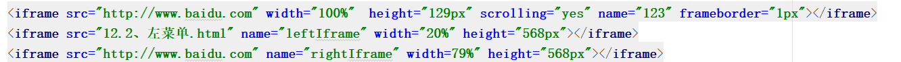

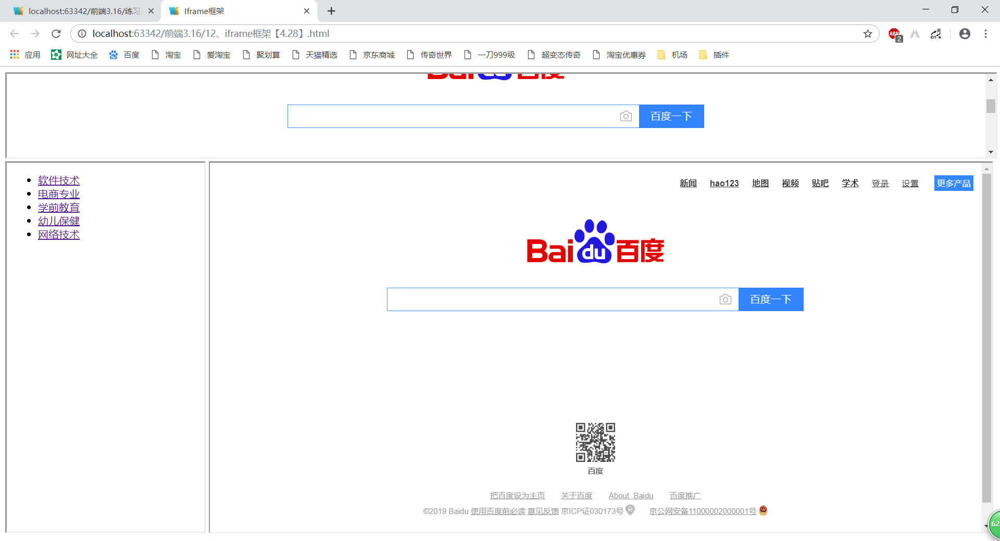

------


## 9、form表单【4.29】

```
1、name表单提交时的名称、action提交到的地址、method（get默认、post）提交方式
2、post与get区别
	get提交的数据url可以看到，post看不到
	get一般提交少量数据且速度快，post提交大量数据
	get最多提交1KB数据，post没有限制
	get提交的数据在浏览器历史记录中，安全性不好
3、完整表单包括：表单标签、表单域（存放表单的区域）、表单按钮（信息提交）
4、表单标签（控件）：都由`input（包含 name、value）`
	注意：1、`input`是单标签
      	 2、input通过type属性更改形状
5、text单行文本、password密码框、radio单选、CheckBox复选框、hidden隐藏域、file文件上传（加enctyoe="multipart/form-data" 表示文件以二进制方式上传） submit提交按钮、button普通按钮、reset重置按钮，图片按钮
6、<select><option>  </option></select>下拉框
  (1、select属性
  	name名字、multiple多选,不赋值、size课件选项数目（显示几行）
    disabled规定禁用下拉列表
  (2、option属性
    selected默认选项、value选项赋值，传到服务器
8、label（点击文字直接光标定位输入框内）
	使用方法：直接使用label标签包裹
	通过label的for指向按钮的id来绑定，for和id属性值相同
9、fieldset元素集，将元素分组，和legend标签使用
```

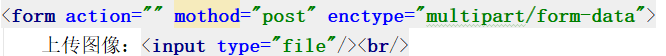

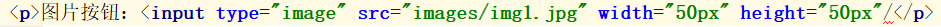

 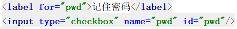

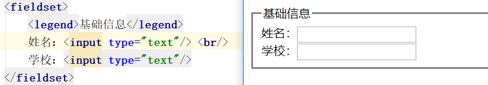

------


## 10、HTML新增input类型【4.30】

``` 
 1、type="email"邮箱
 2、type="search"输入搜索关键字的文本框
 3、type="url" ，输入web站点的文本框
 4、type="color",预定义的颜色拾取控件
 5、type="number",数字类型，min最小值，max最大值，step步长
 6、type="range",选择范围内的一个值，min最小值，max最大值，step步长，value初始值
 7、type="date",日期类型；week,周类型；month，月类型
 8、placeholder,默认提示
 9、multiple，一个格子中输入多个值，逗号隔开
 10、autofocus，自动获取焦点
 11、required,防止为空
 12、minlength,最小字符数；maxlength最大字符数
 13、min允许最小数字；max允许最大数字
```

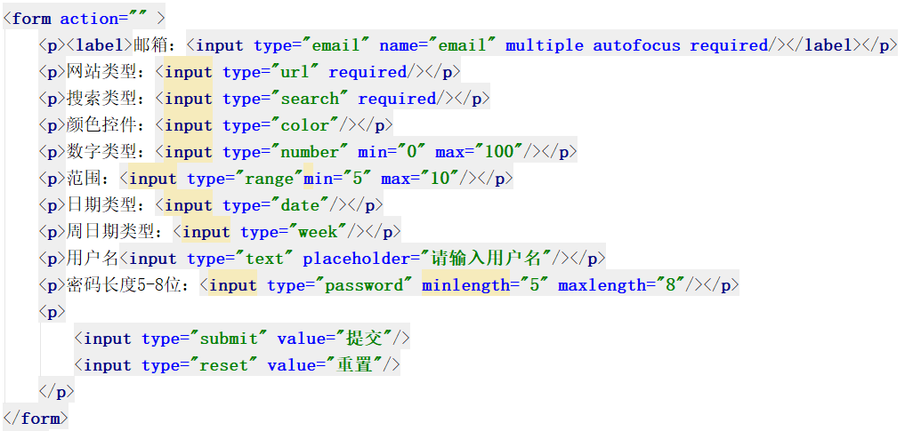

------


## 11、div和span标签【5.1】

1. div（块级标签）、span（行内标签）无语义标签或节标签
2. `span{span标签$}*3`，快速创建多个span标签
3. 块元素与行内元素区别

   块级元素：`p、div、ul、ol、li、h1-h6`
   行内元素：`span、strong、em`

   （1、块级元素可以包含行内元素和块级元素
   （2、行内元素一般不包含块级元素

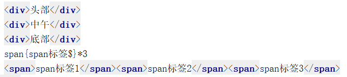

> 什么是标签的显示模式？

标签以什么方式进行显示，比如自占一行、一行可放多个

> 作用：
>

网页标签非常多，不同的地方会用到不同类型的标签，以便更好的完成网页

> 标签分类：
>

行内标签、块标签

------


## 12、HTML新增标签【5.2】

- `header`头部<br>
- `nav`导航<br>
- `section`定义文章中的节（章节、页眉、页脚）<br>
- `aside`侧边栏<br>
- `footer`页脚<br>
- `article`代表一个独立的完整的相关内容块（论坛帖子、博客文章、用户评论)<br>
- `figure`、用于元素进行组合，图片图片组合；

结构：

```html
<figure>
	图片</img>
	<figcation>文字</figcation>
</figure>
```

- details描述文档或文档某个部分的细节

  结构：

```html
<details>
	<summary>details中的标题</summary>
	<p>详细的内容</p>
</details>
```

**代码：**

```html
<details>
    <summary>日本新天皇正式即位 浑身是戏宫斗冠军非他莫属</summary>
    <p>大家好，我是身在朝阳、心系大咖的朝阳咖。</p
</details>
```

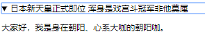

- `mark`在文本下加个背景色，突出

**代码：**

```html
<p>上海<mark>行健</mark>职业学院</p>
```


- `meter`,标签定义度量衡，用于一直最大和最小值的度量

```html
<meter min="" value=""></meter>
<meter min="0" max="100" value="100" low="20" high="80"></meter>
```

`low`最低临界点；`high`最高临界点;`min`设定最小值；`max`设定最大值；`value`当前值

**代码：**

```html
<meter min="0" max="100" value="100" low="20" high="80">度量值</meter>
```

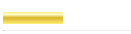

- `progress`运行的进度条;max定义完成值；`value`定义当前值

```html
<progress max="100" value="30"></progress>
```

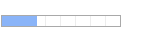

- `datalist`定义选项列表，与`input`配合使用，选项不会显示出来，仅是合法的输入值列表
     结构：

```html
<input id="mycar" list="cars">
<datalist id="cars">
<option value="bwm">
    <option value="ford">
    <option value="volvo">
<datalist>
```

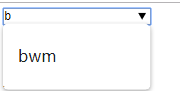

------


## 13、视频【5.2】

```
1、<video src=" ">,src视频地址
2、autoplay，是否自动播放
3、controls，播放按钮
4、height播放器高度；width播放器宽度
5、loop，循环播放
6、muted，静音
7、poster，点击播放前/下载前下显示图像
8、preload，页面加载时进行视频加载
```


------


## 14、音频【5.2】

- `<audio src=" "></audio>`支持ogg、MP3、wav`格式
- `autoplay`，自动播放
- `controls`，播放控件
- `loop`，循环播放;值为正数，如果为负数或者不加任何属性值 无限播放
- `muted`，静音播放
- `preload`，页面加载时加载音乐
- `source`，媒介元素，浏览器
     结构：

```html
<audio controls>
	<source src=" ">
	<source src=" ">
</audio>
```

------


## 15、embed标签【5.2】

> `embed`，嵌入声音、视频、插件(可以到视频网站复制视频HTML代码)

 

------


## 16、canvas标签【5.2】

1.`canvas`只是一个容器/画布，可通过坐标绘制图形；若需要绘画需要配合js<br>2.画布是一个矩形区域，可以控制其每一个像素<br>3.`canvas`拥有多种绘制路径，矩形、圆形。<br>


 
